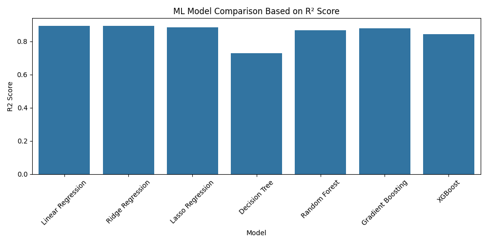

# Data Generation using Modelling and Simulation for Machine Learning

## Objective
The objective of this project is to demonstrate how modelling and simulation techniques can be used to generate synthetic data for machine learning. The generated data is then used to train and compare multiple machine learning models to identify the best-performing model.

---

## Simulation Methodology
A traffic-inspired stochastic simulation model was implemented using Python. The simulator represents a simplified traffic scenario where different traffic parameters affect the average waiting time of vehicles.

Since collecting real-world traffic data is costly and time-consuming, simulation provides a controlled and efficient approach for data generation. To make the simulation realistic, controlled Gaussian noise was added to the output to model real-world uncertainty.

---

## Simulation Parameters

| Parameter | Description | Lower Bound | Upper Bound |
|----------|-------------|-------------|-------------|
| vehicle_count | Number of vehicles | 50 | 500 |
| traffic_density | Traffic density | 0.1 | 1.0 |
| avg_speed | Average speed (km/h) | 20 | 80 |
| signal_duration | Traffic signal duration (seconds) | 20 | 120 |
| lane_count | Number of lanes | 1 | 4 |

---

## Data Generation Process
1. Random values were generated for each simulation parameter within the defined bounds  
2. Each parameter set was passed to the simulation model  
3. The simulator computed the average vehicle waiting time  
4. Gaussian noise was added to improve realism  
5. This process was repeated for 1000 simulation runs  
6. The final dataset was stored in CSV format  

### Generated Dataset
The complete simulation-generated dataset is stored in:

traffic_simulation_dataset.csv

This dataset contains:
- Input features generated from the simulation parameters
- Output target variable (`avg_waiting_time`)
- 1000 rows corresponding to 1000 simulation runs

---

## Google Colab Notebook
The entire implementation was developed and executed using **Google Colab**.

<https://colab.research.google.com/github/shreyataluja2/Data-Generation-using-Modelling-and-Simulation-for-ML/blob/main/simulation_ml.ipynb>

Notebook file:
simulation_ml.ipynb

The notebook includes:
- Simulation logic
- Dataset generation
- Machine learning model training
- Model evaluation
- Result visualization

---

## Machine Learning Models Used
The following regression models were trained and evaluated:

- Linear Regression  
- Ridge Regression  
- Lasso Regression  
- Decision Tree Regressor  
- Random Forest Regressor  
- Gradient Boosting Regressor  
- XGBoost Regressor  

---

## Evaluation Metrics
Each model was evaluated using the following metrics:

- Mean Absolute Error (MAE)  
- Root Mean Squared Error (RMSE)  
- R² Score  

---

## Results Table
The performance comparison of all machine learning models is stored in the following file:

results_table.csv

---

## Result Graph
The following graph compares all machine learning models based on their R² Score:

The graph clearly shows that ensemble-based models outperform linear models due to their ability to capture non-linear relationships in simulation-generated data.

---

## Best Performing Model
The best-performing model achieved the highest R² score with the lowest error metrics.

📄 Best model summary:
best_model.txt

---

## Key Observations
- Simulation-based data generation is effective for machine learning tasks  
- Adding noise improves realism and prevents overfitting  
- Ensemble models outperform linear models  
- Simulation is useful when real-world data is unavailable  

---

## Tools and Technologies Used
Python, Google Colab, NumPy, Pandas, scikit-learn, XGBoost, Matplotlib, and Seaborn were used in this project.

---

## Repository Contents
simulation_ml.ipynb
traffic_simulation_dataset.csv
results_table.csv
best_model.txt
model_comparison_r2.png
README.md
requirements.txt

---

## Conclusion
This project demonstrates how modelling and simulation can be effectively used to generate synthetic datasets for machine learning. The experimental results show that ensemble-based models provide superior performance when trained on simulation-generated data.
